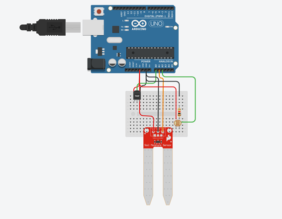

# EDGE_COMPUTING-CP04

## Integrantes

|            Nome            |   RM   |
| :------------------------: | :----: |
| Gabriel Machado Belardino  | 550121 |
|  Ana Beatriz Farah Alvez   | 97865  |
|  Kaiky Alvaro de Miranda   | 98118  |
|  Lucas Rodrigues da Silva  | 98344  |
| Pedro Henrique Bicas Couto | 99534  |

---

## Descrição do Projeto

Esse é um projeto desenvolvido para atender as necessidades da vinheira Agnello. Com o objetivo de garantir a qualidade de deus produtos, foi desenvolvido um sistema de monitoramento do ambiente do vinho, do qual devem ter sua temperatura, umidade e luminosidade.

---

## Objetivo do projeto

Desenvolver um sistema que envie a cada 5 segundos a temperatura, luminosidade e umidade para um servidor.

---

## Materiais necessários

|  Componente  | Quantidade |
| :----------: | :--------: |
|    ESP32     |     1      |
|    DHT11     |     1      |
|     LDR      |     1      |
| Resistor 1KΩ |     1      |


> Apenas um protótipo do projeto desenvolvido no Tinkercad.

---

## Instalação do sistema

### Dependências

- [Arduino IDE](https://www.arduino.cc/en/software)
- [ESP32](
https://www.arduino.cc/reference/en/libraries/esp32/)
- [DHT11](
https://www.arduino.cc/reference/en/libraries/dht-sensor-library/)
- [WiFi](
https://www.arduino.cc/en/Reference/WiFi)

### Passo a passo

|Passo|Detalhe|
|:---:|:---:|
|1| Conecte os sensores ao ***ESP32***|
|2| CLone o repositório|
|3| Abra o arquivo [`codigo_fonte.ino`](./codigo_fonte.ino) no Arduino IDE|
|4| Conecte a placa ESP32 no computador|
|5| Selecione a placa ESP32 na IDE|
|6| Compile e faça o upload do código para a placa|
|7| Abra o monitor serial para visualizar os dados enviados|

> Lembre que é necessário alterar as seguintes constantes para o funcionamento do sistema
>
>>``` C++
>>#define ldr A0
>>#define dhtPin 13
>>...
>>char ssid[] = "<Nome da Rede>";
>>char pass[] = "<Senha da Rede>";
>>...
>>char tokenHeader[]   = "<Chave do servidor>"; 
>>```

---
